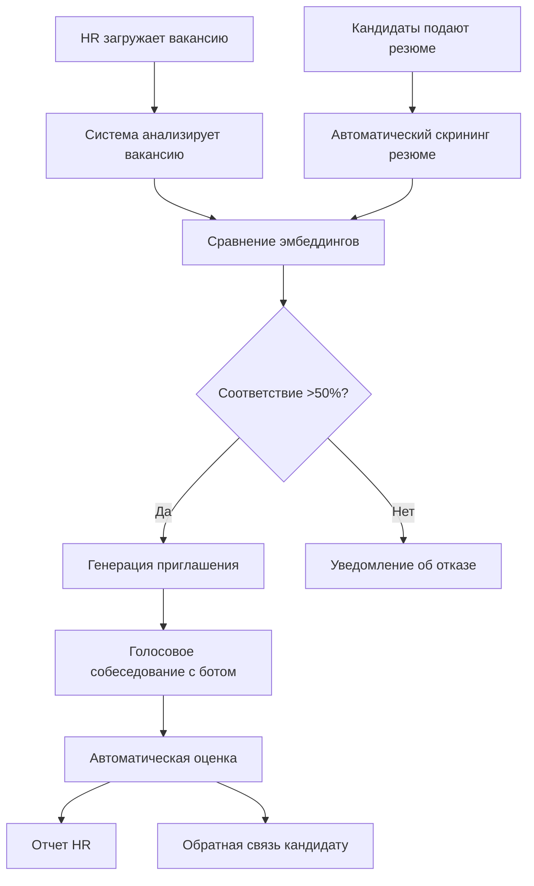
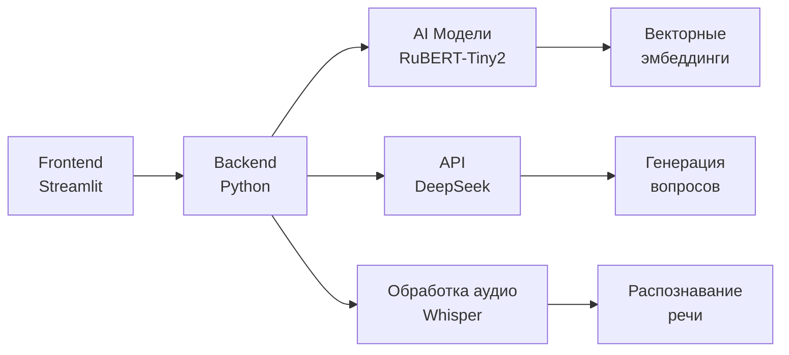
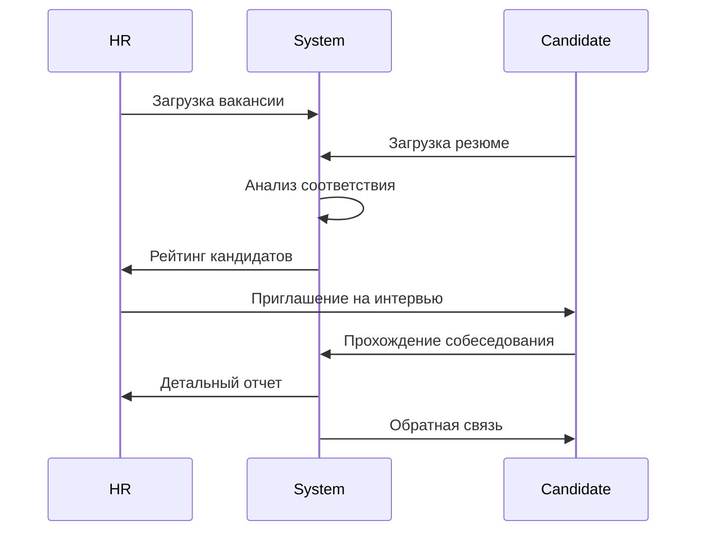

# Хакатон ВТБ/трек HR_AI (команда Mindshift)
# 🤖 Interview Bot Лев - AI-Powered Hiring Assistant

<div align="center">

[](https://streamlit.io/)
[](https://pytorch.org/)
[](https://python.org/)

**Revolutionizing recruitment with AI-driven voice interviews and intelligent candidate matching**

</div>

## 🎯 Уникальное предложение

**Interview Bot Лев** - это end-to-end платформа для автоматизации первичного отбора кандидатов, которая сочетает в себе:

### 🚀 Инновационные особенности:
- **Голосовое AI-собеседование** с реалистичным интервьюером Львом
- **Умный скрининг резюме** на основе RuBERT-Tiny2 с точной оценкой соответствия
- **Автоматическая генерация персонализированных вопросов** с учетом специфики вакансии
- **Полностью автоматизированный workflow** от загрузки резюме до финального отчета

### 💡 Почему это наилучшее решение:

| Особенность | Преимущество | Технология |
|-------------|--------------|------------|
| **Локальная обработка эмбеддингов** | Быстрота и конфиденциальность данных | RuBERT-Tiny2 |
| **Голосовой интерфейс** | Естественное взаимодействие | Yandex SpeechKit + Whisper |
| **Контекстная генерация вопросов** | Релевантность собеседования | DeepSeek AI |
| **Автоматическая оценка** | Объективность и беспристрастность | ML-алгоритмы |

## 📊 Как это работает


```mermaid
graph TD
    A[HR загружает вакансию] --> B[Система анализирует вакансию]
    C[Кандидаты подают резюме] --> D[Автоматический скрининг резюме]
    B --> E[Сравнение эмбеддингов]
    D --> E
    E --> F{Соответствие >50%?}
    F -->|Да| G[Генерация приглашения]
    F -->|Нет| H[Уведомление об отказе]
    G --> I[Голосовое собеседование с ботом]
    I --> J[Автоматическая оценка]
    J --> K[Отчет HR]
    J --> L[Обратная связь кандидату]
```
## 🏗️ Архитектура решения

```mermaid
graph LR
    A[Frontend<br>Streamlit] --> B[Backend<br>Python]
    B --> C[AI Модели<br>RuBERT-Tiny2]
    B --> D[API<br>DeepSeek]
    B --> E[Обработка аудио<br>Whisper]
    C --> F[Векторные<br>эмбеддинги]
    D --> G[Генерация<br>вопросов]
    E --> H[Распознавание<br>речи]
```
## 🔄 Workflow процесса

```mermaid
sequenceDiagram
    participant HR
    participant System
    participant Candidate
    
    HR->>System: Загрузка вакансии
    Candidate->>System: Загрузка резюме
    System->>System: Анализ соответствия
    System->>HR: Рейтинг кандидатов
    HR->>Candidate: Приглашение на интервью
    Candidate->>System: Прохождение собеседования
    System->>HR: Детальный отчет
    System->>Candidate: Обратная связь
```
### 🔧 Технологический стек

**Backend & AI:**
- **PyTorch 2.1.0** + **Transformers 4.36.0** - обработка естественного языка
- **RuBERT-Tiny2** (cointegrated/rubert-tiny2) - локальные эмбеддинги для конфиденциальности
- **DeepSeek API** - генерация контекстных вопросов через chat completions
- **Whisper OpenAI** - распознавание речи кандидатов

**Frontend & Interaction:**
- **Streamlit 1.32.0** - веб-интерфейс и управление состоянием
- **Yandex SpeechKit** - синтез речи интервьюера (TTS)
- **SoundDevice 0.4.6** + **SoundFile 0.12.1** - запись аудиоответов

**Data Processing:**
- **PyMuPDF 1.23.8** - обработка PDF документов
- **python-docx 1.1.0** - работа с Word документами
- **striprtf 0.0.25** - обработка RTF файлов
- **pandas 2.0.3** - работа с CSV данными
- **scikit-learn 1.3.0** - вычисление косинусного сходства

**Вспомогательные библиотеки:**
- **requests 2.31.0** - HTTP запросы к API
- **pygame 2.5.0** + **playsound 1.3.0** - воспроизведение аудио
- **numpy 1.24.3** - численные вычисления

### 📋 Описание ключевых файлов:

| Файл | Назначение |
|------|------------|
| **`app_streamlit_loc.py`** | Основное веб-приложение (запуск отсюда) |
| **`app.py`** | Класс InterviewBot - ядро системы |
| **`document_processor.py`** | Чтение PDF, DOCX, RTF, TXT, CSV, JSON |
| **`audio_recording.py`** | Запись аудиоответов кандидатов |
| **`audio_text.py`** | Синтез и распознавание речи |
| **`config.py`** | Настройки API ключей (создать) |

### 🗂️ Автоматически создаваемые папки:

| Папка | Содержимое |
|-------|------------|
| **`audio/questions/`** | Озвученные вопросы (генерируются) |
| **`audio/answers/`** | Ответы кандидатов (записываются) |
| **`reports/`** | Отчеты в JSON и TXT форматах |
| **`model/`** | Локальная модель RuBERT-Tiny2 |

---
## ⚙️ Установка и запуск

### 1. Клонирование и настройка

```bash
# Клонируйте репозиторий
git clone https://github.com/OlgaKonshina/HR_AI
cd interview-bot

# Создайте виртуальное окружение
python -m venv venv
source venv/bin/activate  # Linux/Mac
# или
venv\Scripts\activate     # Windows

# Установите зависимости
pip install -r requirements.txt
```
##  2. Настройка API ключей
```
Создайте файл config.py в корне проекта:
DEEPSEEK_API_KEY = "your-deepseek-api-key-here"
YANDEX_API_KEY = "your-yandex-cloud-api-key-here" 
YANDEX_FOLDER_ID = "your-yandex-folder-id-here"
```
### 3. Загрузка модели RuBERT-Tiny2
```
# Создайте папку для модели
mkdir -p model

# Загрузите модель (автоматически при первом запуске)
# или скачайте вручную и поместите в папку model/
```

### 4. Запуск приложения
```
streamlit run app_streamlit_loc.py
Приложение будет доступно по адресу: http://localhost:8501
```
###🎯 Как использовать
Шаг 1: Загрузка документов
Загрузите описание вакансии (PDF, DOCX, RTF, TXT, CSV, JSON)

Загрузите резюме кандидата в любом из поддерживаемых форматов

Шаг 2: Анализ соответствия
Система автоматически извлечет текст и оценит схожесть

При соответствии ≥80% станет доступно собеседование

Шаг 3: Проведение собеседования
Выберите количество вопросов (3-15)

Нажмите "🚀 Старт собеседования"

Отвечайте на голосовые вопросы

Шаг 4: Получение результатов
Просмотрите историю диалога в сайдбаре

Получите итоговую оценку и рекомендации

Отчеты сохраняются в папке reports/

🔧 Технические детали
Модели и API
RuBERT-Tiny2: Локальная модель для эмбеддингов и анализа схожести

DeepSeek AI: Генерация вопросов и обратной связи

Yandex SpeechKit: Синтез речи (TTS)

OpenAI Whisper: Распознавание речи (STT)

Поддерживаемые форматы документов
Текст: TXT, RTF

Офисные: PDF, DOCX

Данные: CSV, JSON

Аудио форматы
Запись: OGG (48kHz)

Воспроизведение: OGG Opus

📊 Пример вывода
text
🔗 Схожесть резюме и вакансии: 88.45%
✅ Кандидат подходит! Можно начать собеседование.

📝 Обратная связь: Отличный ответ! Кандидат продемонстрировал глубокое понимание...
🎯 Итоговая оценка: Кандидат показал высокий уровень компетенций...
🚀 Производительность
⚡ Быстрая обработка документов (до 5 сек на файл)

🎙️ Низкая задержка аудио (менее 2 сек)

🤖 Умная генерация контекстных вопросов

📊 Точная оценка соответствия вакансии


<div align="center">
Сделано с ❤️ для автоматизации HR-процессов
Состав команды:
1. Коньшина Ольга
2. Ильиных Виктория
</div> ```
